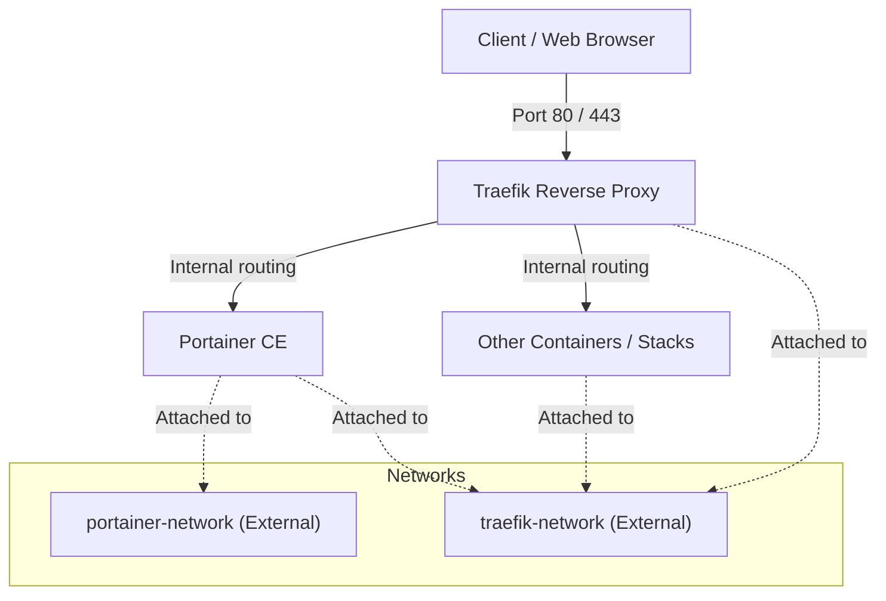

# Traefik & Portainer Docker Compose Stack

This repository contains a production-ready, highly flexible Docker Compose stack featuring **Portainer** (for container management) and **Traefik v3** (as a reverse proxy and automatic SSL manager via Let's Encrypt). 

It is designed to give you complete control over your Traefik configuration, allowing you to secure the Portainer UI, the Traefik Dashboard, and any other containers provisioned via Portainer under their own domains with automatic HTTPS.

---

## Architecture Overview



- **Traefik** listens on host ports `80` (HTTP), `443` (HTTPS), and `9443` (dedicated Portainer port). It uses the **HTTP Challenge** on port 80 to automatically validate, obtain, and renew TLS certificates from Let's Encrypt.
- **Portainer** is accessible securely via HTTPS on port `9443` or through standard subdomains, with its volume data persisted locally.
- **Other Containers** provisioned via Portainer can hook into Traefik simply by joining the `traefik-network` and applying standard Traefik container labels.

---

## Directory Structure

```text
.
├── docker-compose.yml       # Docker Compose service definition
├── traefik.yml              # Traefik static configuration (ports, entrypoints, providers)
├── dynamic/
│   └── dynamic_conf.yml     # Traefik dynamic configuration (middlewares, TLS settings)
├── .env.example             # Template file for environment variables
└── .gitignore               # Prevents tracking of local secrets (.env)
```

---

## Prerequisites

Before deploying the stack, ensure you have:
1. **Docker & Docker Compose** installed on your VM.
2. A **public IP address** with ports **80**, **443**, and **9443** allowed in your network firewall/security groups.
3. **DNS A Records** pointing to your public IP for all domains/subdomains (e.g., `portainer.yourdomain.com`, `traefik.yourdomain.com`).
4. **Pre-created external Docker networks**:
   Traefik and Portainer rely on isolated external networks to safely communicate with other containers.
   ```bash
   docker network create traefik-network
   docker network create portainer-network
   ```

---

## Setup & Installation

### Step 1: Clone and Configure Environment

1. Copy the example environment template:
   ```bash
   cp .env.example .env
   ```
2. Edit `.env` and fill in your actual settings:
   - Configure your domain names for `PORTAINER_FRONTEND_HOSTNAME` and `TRAEFIK_HOSTNAME`.
   - Update `TRAEFIK_ACME_EMAIL` with your email to receive Let's Encrypt notifications.

### Step 2: Generate Traefik Dashboard Credentials

The Traefik dashboard is protected by Basic Authentication. You must generate a Bcrypt password hash for your dashboard username.

Run the following command on your host machine to generate the hash (replace `admin` with your preferred username, you will be prompted for a password):
```bash
echo $(htpasswd -nB admin) | sed -e 's/\$/\$\$/g'
```
*Note: The `sed` command automatically doubles the dollar signs (`$$`) to prevent Docker Compose from interpreting them as environment variables.*

Copy the output and set it as the value for `TRAEFIK_BASIC_AUTH` in your `.env` file.

### Step 3: Deployment

Start the stack in detached mode:
```bash
docker compose up -d
```

To verify the containers are running and healthy:
```bash
docker compose ps
```

To monitor logs (useful for checking Let's Encrypt certificate generation status):
```bash
docker compose logs -f traefik
```

---

## Exposing Other Containers / Stacks

To expose any other container or stack deployed via Portainer (or directly on the host) through Traefik, follow these two rules:

### 1. Network Connection
Your container **must** be connected to the `traefik-network`. 

### 2. Labels Configuration
Add the appropriate Docker labels to your service. Below is a complete Docker Compose example of a service being exposed:

```yaml
version: '3.8'

services:
  my-app:
    image: nginx:alpine
    restart: unless-stopped
    networks:
      - traefik-network
    labels:
      - "traefik.enable=true"
      # Match the incoming hostname
      - "traefik.http.routers.myapp.rule=Host(`myapp.yourdomain.com`)"
      # Route through the secure HTTPS entrypoint
      - "traefik.http.routers.myapp.entrypoints=websecure"
      # Enable TLS
      - "traefik.http.routers.myapp.tls=true"
      # Use Let's Encrypt certificate resolver defined in traefik.yml
      - "traefik.http.routers.myapp.tls.certresolver=letsencrypt"
      # Internal container port that your application listens to
      - "traefik.http.services.myapp.loadbalancer.server.port=80"

networks:
  traefik-network:
    external: true
```

---

## Advanced Configurations (Dynamic Config & Middlewares)

The dynamic configuration folder `dynamic/` is monitored in real-time by Traefik. Changes made to files inside this directory are loaded instantly without restarting the Traefik container.

### 1. Custom Middlewares
We have pre-defined two useful middlewares in `dynamic/dynamic_conf.yml`:
- `security-headers@file`: Applies security best-practices (HSTS, XSS protection, Frame prevention).
- `rate-limit@file`: Limits request rates to protect against brute-force.

To apply these middlewares to your container, add the following label:
```yaml
labels:
  - "traefik.http.routers.myapp.middlewares=security-headers@file,rate-limit@file"
```

### 2. Custom TLS Options
By default, the configuration restricts TLS connections to secure protocols (minimum TLS version 1.2) and secure cipher suites. This is automatically applied to all routers.
